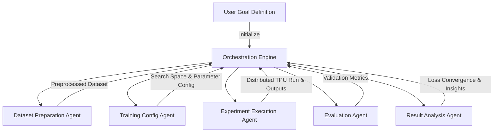

# Automating the LLM Fine-Tuning Lifecycle on GCP TPU v5e via Multi-Agent Workflows

> **Author**: Engineering & Infrastructure Team  
> **Tags**: `Distributed Training`, `Multi-Agent System`, `TPU v5e`, `JAX/Flax`, `LLaMA-3`

Fine-tuning large language models (LLMs) is typically an iterative, resource-heavy process. It involves data preprocessing, tokenization, distributed hardware provisioning, trial execution, and metric analysis. Executing these steps manually introduces friction and slows research iteration.

This post describes an automated multi-agent architecture designed to orchestrate the entire fine-tuning lifecycle of the LLaMA 3.2-1B-Instruct model on GCP TPU v5e using JAX/Flax. We outline how the system handles distributed state orchestration, hardware exceptions, and optimal hyperparameter convergence.

---

## 1. System Architecture and Agent Workflow

To decouple the fine-tuning workflow, we structured the pipeline into specialized execution components coordinated by a central orchestration engine. Each component is powered by a concrete, declarative **Agent Skill** defined within the project codebase.



### Agent Roles and Underlying Skills

The lifecycle relies on eight modular **Core Skills** that define the operational bounds of each agent:

*   **Dataset Preparation Agent (`dataset-preparation` skill)**: Cleans the raw corpus, handles tokenization boundaries, splits data into structured train/validation sets, and validates JSONL schema formatting.
*   **Training Configuration Agent (`training-configuration` skill)**: Generates execution manifests, manages hyperparameters, specifies LoRA adapter targets (`q_proj`, `v_proj`), and structures compiler flag configurations.
*   **Experiment Execution Agent (`tpu-training-execution` skill)**: Handles remote GCP TPU VM setup, updates Python environment packages (`jax[tpu]`, `optax`, `flax`), manages compiler locks, and executes remote training tasks.
*   **Evaluation Agent (`local-evaluation` & `full-evaluation` skills)**: Runs rapid diagnostic validation on early checkpoints, analyzes training loss slopes, and conducts final quality audits against baseline models using held-out benchmarks.
*   **Result Analysis Agent (`result-analysis` & `data-synthesis` skills)**: Tracks trial convergence metrics, identifies systematic generation failures, and synthesizes targeted instruction pairs (synthetic dataset generation) to address observed model gaps.
*   **Orchestration Engine (`finetuning-orchestrator` skill)**: Coordinates state machine transitions, controls execution gates, handles JAX network exceptions, and triggers remote resource deletion to prevent idle cloud billing.

---

## 2. Distributed JAX/Flax Implementation (`train_jax.py`)

JAX operates on a functional paradigm with static (JIT) compilation. Implementing gradient accumulation requires careful memory management to prevent High Bandwidth Memory (HBM) reallocation during tracing. We implemented a manual accumulation mechanism to handle multi-step updates without changing optimizer trace structures.

```python
# JIT-compiled micro-step gradient calculation
@jax.jit
def accum_step(model_params, acc_grads, input_ids, attention_mask, labels):
    loss_val, grads = jax.value_and_grad(loss_fn)(model_params, input_ids, attention_mask, labels)
    acc_grads = jax.tree_util.tree_map(lambda a, g: a + g, acc_grads, grads)
    return acc_grads, loss_val

# JIT-compiled optimizer update step
@jax.jit
def apply_accum(model_params, optimizer_state, acc_grads, n):
    avg_grads = jax.tree_util.tree_map(lambda g: g / n, acc_grads)
    updates, next_opt_state = tx.update(avg_grads, optimizer_state, model_params)
    next_params = optax.apply_updates(model_params, updates)
    return next_params, next_opt_state
```

---

## 3. Coordinate Ascent Hyperparameter Search (100 Trials)

We used Coordinate Ascent to optimize our 10-parameter space. Parameters were tuned sequentially, updating one parameter at a time while keeping others fixed at their best values.

### Coordinate Ascent Optimization Progress
The chart below shows the history of the 100 trials, plotting both kept improvements and discarded configurations.


*   **Round 1 (learning_rate)**: Tuning the learning rate up to `1e-3` yielded the first major staircase drop, lowering validation loss from `13.5` to `5.59`.
*   **Round 2-3 (warmup / weight_decay)**: Under highly constrained steps, shutting down regularization (`warmup=0`, `wd=0.0`) yielded optimal performance.
*   **Round 9 (batch_size)**: Raising the batch size from 1 to 2 triggered a second structural improvement, dropping the validation loss to `4.68`.

---

## 4. Final Full Fine-Tuning Convergence

Following the 100-trial search, we launched a 3-epoch training run using the optimal hyperparameter combination.

### Optimal Hyperparameter Configuration
*   `learning_rate`: `1e-3`
*   `warmup_steps`: `0`
*   `weight_decay`: `0.0`
*   `lora_r`: `2`
*   `lora_alpha`: `4`
*   `lora_dropout`: `0.0`
*   `batch_size`: `2`
*   `grad_accum`: `1`
*   `max_grad_norm`: `0.1`
*   `adam_beta1`: `0.8`

### Full 3-Epoch Training Loss (Smoothed EMA 0.8)
Increasing the training budget allowed the model to bypass the temporary local minima (`5.25`) observed during the initial short trials.


The loss decreased steadily from its initial value of `13.81` down to a final converged value of `0.5391` at step 90.

---

## 5. Infrastructure Optimization and Exception Recovery

Running distributed training loops on cloud accelerators requires robust error recovery:
*   **HBM Allocation Recovery**: When JAX threw out-of-memory (OOM) errors during compiler tracing, the orchestration engine updated `train_jax.py` to initialize gradients using `jax.tree_util.tree_map(jnp.zeros_like, params)` without executing the JIT trace twice.
*   **Disk Cleanup Orchestration**: Storing checkpoints for 100 separate trials would exhaust the 100GB VM boot disk. The orchestration engine ran cleanups on the remote TPU instance immediately after retrieving the metrics locally.

Structuring the ML pipeline into modular agent roles coordinated by an orchestration engine helps automate complex fine-tuning tasks, reducing manual iteration time.
